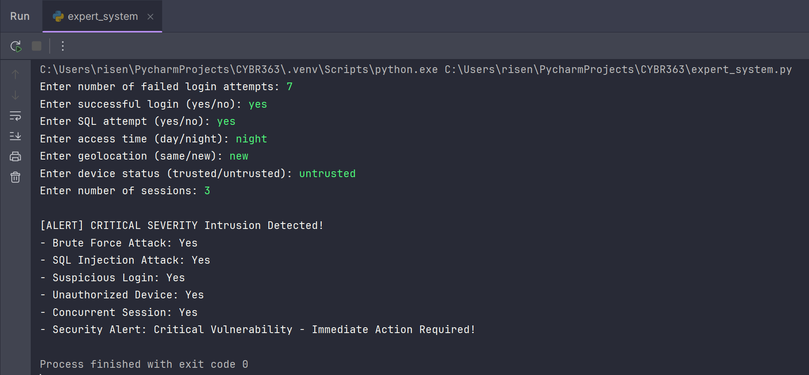
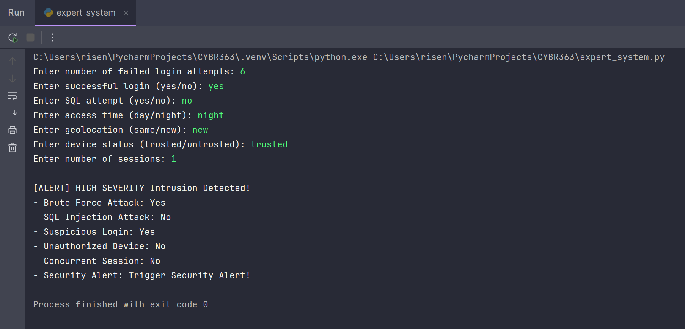
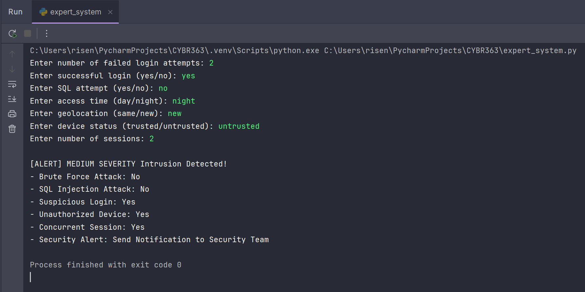
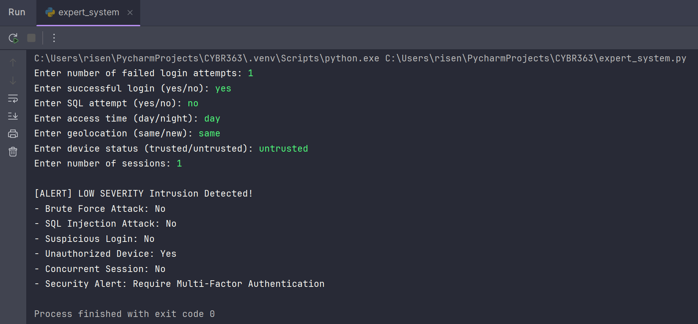
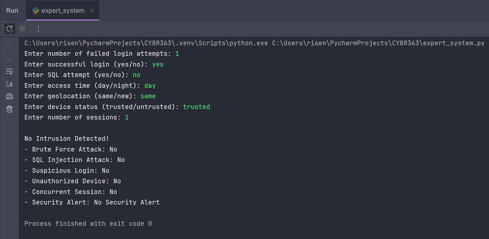

# CYBR363 AI for Cybersecurity

---

### Name: Ryan Eisenbeis
### Section: CYBR363-001 AI for Cybersecurity
### Date: 2.11.2025
### Description: A company wants to automate intrusion detection in its network using an expert system. The system must classify suspicious login attempts and take appropriate security actions. Define the knowledge base (rules), choose an inference mechanism, and implement the expert system.

---

## Part 1: Defining the Knowledge Base

- `brute_force:` **IF** login_attempts > 5 **AND** successful_login = True, **THEN** severity = HIGH **AND** Trigger Security Alert
- `sql_injection:` **IF** sql_attempt = 'yes', **THEN** severity = HIGH **AND** Trigger Security Alert
- `suspicious_login:` **IF** access_time = 'night' **AND** geolocation = 'new', **THEN** severity = MEDIUM **AND** Notify Security Team
- `concurrent_session:` **IF** session_count > 1, **THEN** severity = MEDIUM **AND** Notify Security Team
- `unauthorized_device:` **IF** device_status = 'untrusted', **THEN** severity = LOW **AND** Require MFA

---

## Part 2: Choosing an Inference Mechanism

- For my expert system, I chose to implement a **forward chaining** inference mechanism. Starting with known facts (e.g., login attempts, geolocation, device info).
and applying rules to infer new facts in a step-by-step process (e.g., user input).

---

## Part 3: Examples of the System in Action

#### 1.) Example of a `CRITICAL SEVERITY` Intrusion Detected:

#### 2.) Example of a `HIGH SEVERITY` Intrusion Detected:

#### 3.) Example of another `HIGH SEVERITY` Intrusion Detected:

#### 4.) Example of a `MEDIUM SEVERITY` Intrusion Detected:

#### 5.) Example of a `LOW SEVERITY` Intrusion Detected:

#### 6.) Example of `NO` Intrusion Detected:

